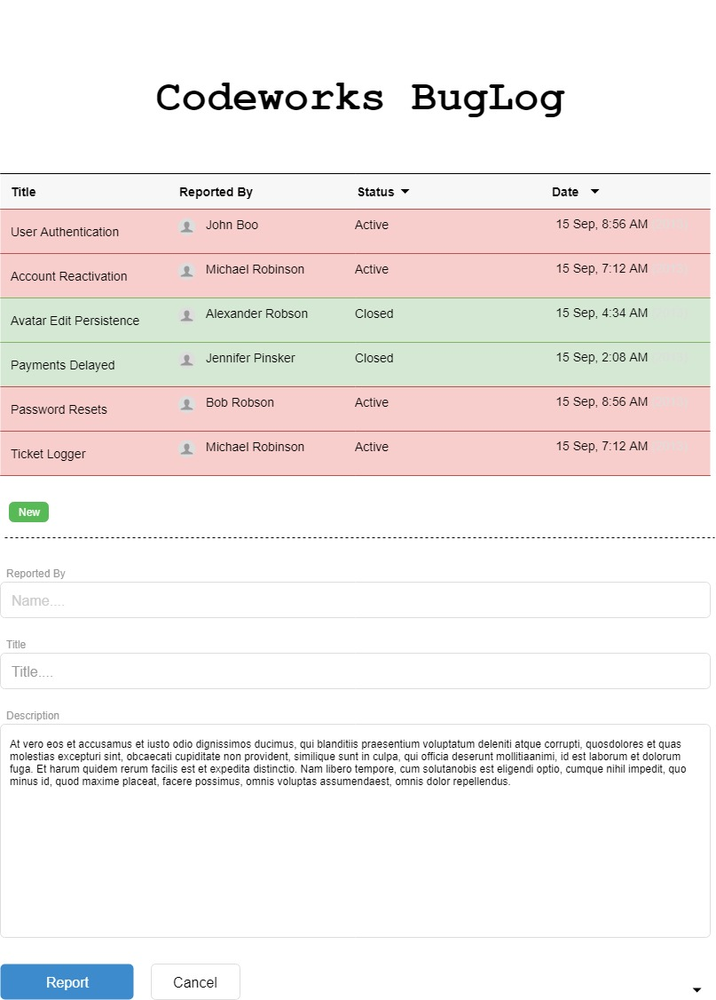
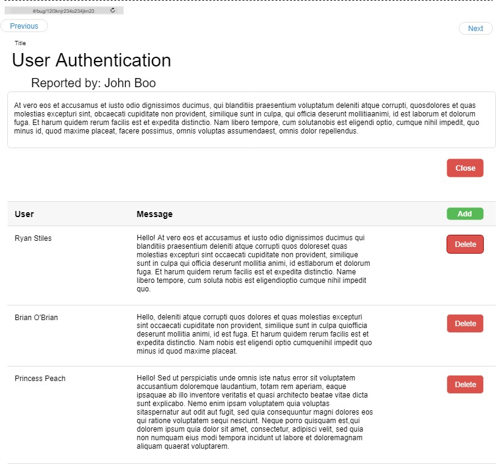

# Bug-Report

Welcome to the Bug-Report! 

You have been tasked with creating a tool to better report bugs for your team. The goal being, to better track bugs in your application, as well as the process taken to solve them.

All bugs will have a title, description, who reported the bug, closedDate and whether or not it has been closed. 

Users can also add notes to the bug report providing detailed steps towards the bugs resolution.

Once a bug has been closed, no further editing is allowed.

Here are some mock-ups from the client
<hr>

### Home View:
<div>
  
</div>

From the Home page users can view all the bugs that have been added, color coded to which are open and closed.

#### Challenges 
Try to implement pagination here, as well as being able to sort by the status or the reported date.
<br>
<br>
<hr>


### Details View:
<div>
  
</div>

The details view provides some additional information about the bug, as well as showing all the comments made by other users. Here comments can be created, flagged for review or removed.

#### Challenges:
 See if you can implement the ability to go next or previous from this page.


<hr>
<br>
<br>

## Bug-Report API


### Bug Schema
```Javascript
var bug = new Schema({
    closed: { type: Boolean, required: true, default: true },
    description: { type: String, required: true },
    title: { type: String, required: true },
    creator: { type: String, required: true } //The provided name for who reported the bug
    user: { type: String, required: true },
    closedDate: { type: String, required: true },

}, { timestamps: true })
```

### Note Schema
```Javascript
var note = new Schema({
    content: { type: String, required: true },
    bug: { type: ObjectId, ref: 'Bug' required: true },
    creator: { type: String, required: true } //The provided name for who made the note
    user: { type: String, required: true },
    flagged: { type: String, enum: ["valid", "invalid"] }
}, { timestamps: true })
```


### Endpoints
> baseUrl: `'https://bcw-sandbox.herokuapp.com/api/YOURNAME'`

Get

`/bugs`: returns list of bugs for the user

`/bugs/:id`: returns a single bug with all it's data

`/bugs/:id/comments`: returns all comments for a given bug id

Post

`/bugs`: Creates a new bug

`/bugs/:id/notes`: Adds a new note to the bug. *This can only be done if bug is open*

Put 

>*both of these can only be done if bug is open*

`/bugs/:id`: Edits bug

`/bugs/:id/notes/:id`: Edits note.

Delete

> There is no true bug delete, only changing the status of a bug to closed.

`/bugs/:id`: Changes status of bug from open to close

`/bugs/:id/notes/:id`: Deletes note.


<hr>

## Requirements

### Visualization
- At least 2 supported routes
    - Home shows all bugs
    - Details displays the details of a bug and its comments
- Comments can only be added to a bug from the details view
- Styling Indication on main page that bug is closed (color, strike-through, etc.)
- No option to 'add note' once bug is closed

### Functionality
- Bugs can be created and marked complete
- Notes can be added and removed from a bug
- Bugs can be filtered by at least 1 status type ie. show open bugs
- Utilize the Route Params to retain bug details page on refresh
